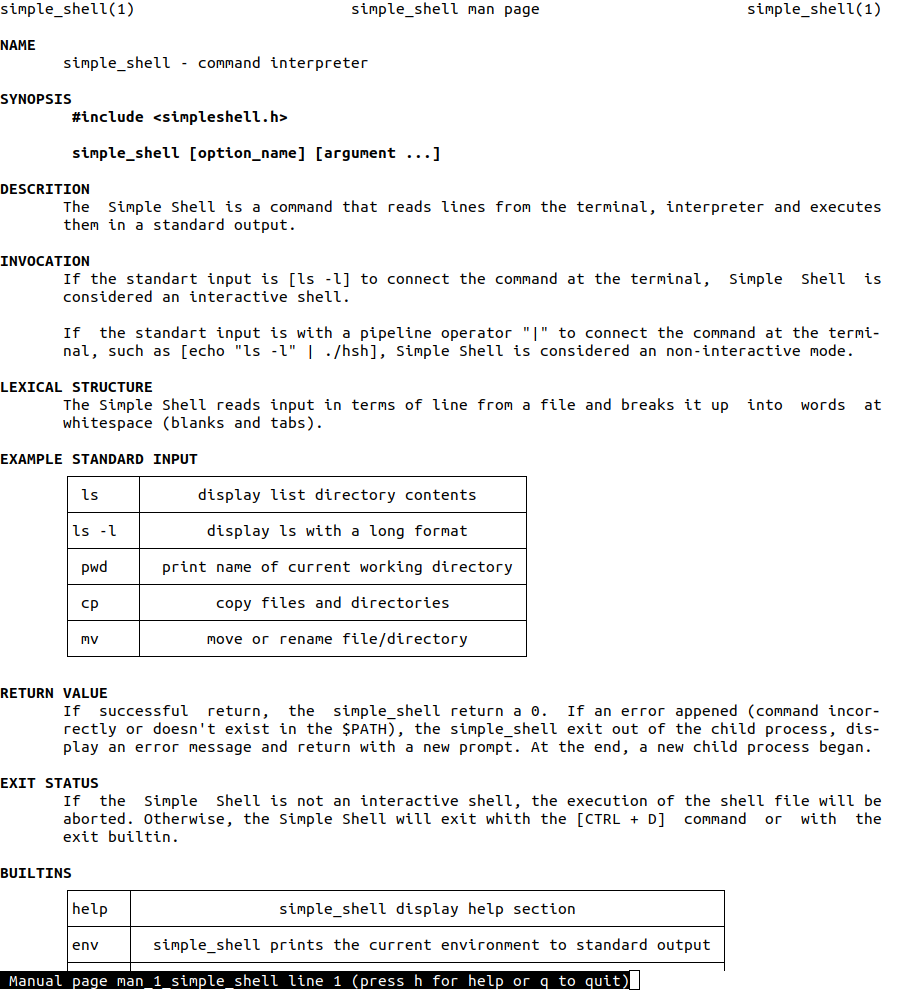

# Project 0x16. C - Simple Shell

## Background Context

There is our second team project. We have to create a simple shell !

Our team, my friend and me (Ivan and Elodie, respectively):


## Tasks (mandatory)

### 0. README, man, AUTHORS

* Write a README
* Write a man for your shell.
* You should have an AUTHORS file at the root of your repository, listing all individuals having contributed content to the repository. Format, see Docker

### 1. Betty would be proud

Write a beautiful code that passes the Betty checks

### 2. Simple shell 0.1

Write a UNIX command line interpreter.

* Usage: simple_shell

Your Shell should:

* Display a prompt and wait for the user to type a command. A command line always ends with a new line.
* The prompt is displayed again each time a command has been executed.
* The command lines are simple, no semicolons, no pipes, no redirections or any other advanced features.
* The command lines are made only of one word. No arguments will be passed to programs.
* If an executable cannot be found, print an error message and display the prompt again.
* Handle errors.
* You have to handle the “end of file” condition (Ctrl+D)

You don’t have to:

* use the PATH
* implement built-ins
* handle special characters : \", ', `, \, *, &, #
* be able to move the cursor
* handle commands with arguments
```
julien@ubuntu:~/shell$ ./shell
#cisfun$ ls
./shell: No such file or directory
#cisfun$ /bin/ls
barbie_j       env-main.c  exec.c  fork.c  pid.c  ppid.c    prompt   prompt.c  shell.c  stat.c         wait
env-environ.c  exec    fork    mypid   ppid   printenv  promptc  shell     stat test_scripting.sh  wait.c
#cisfun$ /bin/ls -l
./shell: No such file or directory
#cisfun$ ^[[D^[[D^[[D
./shell: No such file or directory
#cisfun$ ^[[C^[[C^[[C^[[C
./shell: No such file or directory
#cisfun$ exit
./shell: No such file or directory
#cisfun$ ^C
julien@ubuntu:~/shell$ echo "/bin/ls" | ./shell
#cisfun$ barbie_j       env-main.c  exec.c  fork.c  pid.c  ppid.c    prompt   prompt.c  shell.c stat.c         wait
env-environ.c  exec    fork    mypid   ppid   printenv  promptc  shell     stat test_scripting.sh  wait.c
#cisfun$ julien@ubuntu:~/shell$
```

### 3. Simple shell 0.2

Simple shell 0.1 +

* Handle command lines with arguments

### 4. Simple shell 0.3

Simple shell 0.2 +

* Handle the PATH
* fork must not be called if the command doesn’t exist
```
julien@ubuntu:~/shell$ ./shell_0.3
:) /bin/ls
barbie_j       env-main.c  exec.c  fork.c  pid.c  ppid.c    prompt   prompt.c  shell_0.3  stat    test_scripting.sh  wait.c
env-environ.c  exec    fork    mypid   ppid   printenv  promptc  shell     shell.c    stat.c  wait
:) ls
barbie_j       env-main.c  exec.c  fork.c  pid.c  ppid.c    prompt   prompt.c  shell_0.3  stat    test_scripting.sh  wait.c
env-environ.c  exec    fork    mypid   ppid   printenv  promptc  shell     shell.c    stat.c  wait
:) ls -l /tmp
total 20
-rw------- 1 julien julien    0 Dec  5 12:09 config-err-aAMZrR
drwx------ 3 root   root   4096 Dec  5 12:09 systemd-private-062a0eca7f2a44349733e78cb4abdff4-colord.service-V7DUzr
drwx------ 3 root   root   4096 Dec  5 12:09 systemd-private-062a0eca7f2a44349733e78cb4abdff4-rtkit-daemon.service-ANGvoV
drwx------ 3 root   root   4096 Dec  5 12:07 systemd-private-062a0eca7f2a44349733e78cb4abdff4-systemd-timesyncd.service-CdXUtH
-rw-rw-r-- 1 julien julien    0 Dec  5 12:09 unity_support_test.0
:) ^C
julien@ubuntu:~/shell$
```

### 5. Simple shell 0.4

Simple shell 0.3 +

* Implement the exit built-in, that exits the shell
* Usage: exit
* You don’t have to handle any argument to the built-in exit

### 6. Simple shell 1.0

Simple shell 0.4 +

* Implement the env built-in, that prints the current environment
```
julien@ubuntu:~/shell$ ./simple_shell
$ env
USER=julien
LANGUAGE=en_US
SESSION=ubuntu
COMPIZ_CONFIG_PROFILE=ubuntu
SHLVL=1
HOME=/home/julien
C_IS=Fun_:)
DESKTOP_SESSION=ubuntu
LOGNAME=julien
TERM=xterm-256color
PATH=/home/julien/bin:/home/julien/.local/bin:/usr/local/sbin:/usr/local/bin:/usr/sbin:/usr/bin:/sbin:/bin:/usr/games:/usr/local/games:/snap/bin
DISPLAY=:0
$ exit
julien@ubuntu:~/shell$
```

### 7. What happens when you type `ls -l *.c` in the shell

Write a blog post describing step by step what happens when you type ls -l *.c and hit Enter in a shell. Try to explain every step you know of, going in as much details as you can, give examples and draw diagrams when needed. You should merge your previous knowledge of the shell with the specifics of how it works under the hoods (including syscalls).

# Program HSH

## Description

HSH is a Simple Shell. It's program that takes commands inputs written from the user in the kernel. This program passes them to the machine and execute them.


## Used functions

### Strings tools

[_putchar.c](https://github.com/elodieriou/simple_shell/blob/main/strings_tool.c)
```
/* _putchar - function that write a character to stdout */
int _putchar(char c);
```

[_putstr.c](https://github.com/elodieriou/simple_shell/blob/main/strings_tool.c)
```
/* _putstr - function that print a string
int _putstr(char *s);
```

[_strcmp.c](https://github.com/elodieriou/simple_shell/blob/main/strings_tool.c)
```
/* _strcmp - function that compares two strings */
int _strcmp(char *s1, char *s2);
```

[_strlen.c](https://github.com/elodieriou/simple_shell/blob/main/strings_tool_2.c)
```
/* _strlen - function that calculate the lenght of a string */
int _strlen(char *s);
```

[_strdup.c](https://github.com/elodieriou/simple_shell/blob/main/strings_tool_2.c)
```
/* _strdup - function that duplicate a string */
char *_strdup(char *str);
```

[_strcat.c](https://github.com/elodieriou/simple_shell/blob/main/strings_tool.c)
```
/* _strcat - function that concatenate two strings */
char *_strcat(char *dest, char *src);
```

[_strcpy.c](https://github.com/elodieriou/simple_shell/blob/main/strings_tool.c)
```
/* _strcpy - function that copy a string */
char *_strcpy(char *dest, char *src);
```

### Memory tools

[_memcpy.c](https://github.com/elodieriou/simple_shell/blob/main/memory_tools.c)
```
/* _memcpy - function that copy memory area */
char *_memcpy(char *dest, char *src, unsigned int n);
```

[_realloc.c](https://github.com/elodieriou/simple_shell/blob/main/memory_tools.c)
```
/* _realloc - function that changes the size of the memory */
void *_realloc(void *ptr, unisgned in old_size, unsigned int new_size);
```

[_memset.c](https://github.com/elodieriou/simple_shell/blob/main/memory_tools.c)
```
/* _memset - function that fill memory with a constant byte */
char *_memset(char *s, char b, unsigned int n);
```

### Get environment and PATH

[_getenv.c](https://github.com/elodieriou/simple_shell/blob/main/get_path.c)
```
/* _getenv - function that get an environement variable */
char *_getenv(const char *name);
```

[get_path.c](https://github.com/elodieriou/simple_shell/blob/main/get_path.c)
```
/* get_path - function that get the path to the command file
void get_path(char **av);
```

### Split and execute

[split.c](https://github.com/elodieriou/simple_shell/blob/main/split.c)
```
/* split - function that parse a string */
char **split(char *line, char *delim);
```

[exe.c](https://github.com/elodieriou/simple_shell/blob/main/exe.c)
```
/* exe - function that execute a command */
int exe(char **av);
```

### Builtins

[builtin_exit.c](https://github.com/elodieriou/simple_shell/blob/main/builtin_exit.c)
```
/* builtin_exit - function that exit the program simple_shell */
int builtin_exit(void);
```

[builtin_env.c](https://github.com/elodieriou/simple_shell/blob/main/builtin_env.c)
```
/* builtin_env - function that print an environment variable */
int builtin_env(void);
```

[builtin_help.c](https://github.com/elodieriou/simple_shell/blob/main/builtin_help.c)
```
/* builtin_help.c - function that help the user */
int builtin_help(char **av);
```

[check_builtin.c](https://github.com/elodieriou/simple_shell/blob/main/check_builtin.c)
```
/* check_builtin - function that check if the command is a builtin */
int check_builtin(char **av);
```

[exe_buildins.c](https://github.com/elodieriou/simple_shell/blob/main/exe_builtins.c)
```
/* exe_builtins - function that execute the builtins */
int exe_builtins(char **av);
```

### Handle ctrl+C

[get_signal.c](https://github.com/elodieriou/simple_shell/blob/main/get_signal.c)
```
/* get_signal - function that not quit simple_shell when the user inputs ^C */
void get_signal(int num);
```

### Structure

```
typedef struct builtin_shell
{
	char *name;
	int (*f)(void);
} builtin_t;
```

### Variable extern

```
extern char **environ;
```


## How it work

1. It necessary to compile with the following command:
```
gcc -Wall -Werror -Wextra -pedantic -std=gnu89 *.c -o hsh
```
2. Execute `./hsh` to run and display the prompt `#cisfun$`

3. Pass a command file like `ls`, `ls -la` or `pwd`

4. Use the command `exit` or `ctrl + D` to exit simple_shell

5. Pass this command to clone the repo:
```
git clone https://github.com/elodieriou/simple_shell.git
```


## Valgrind commands

Valgrind Memcheck is a tool that detects memory leaks and memory errors:
* Command for memory leak checks:
```
valgrind --leak-check=full --show-leak-kinds=all ./hsh
```
* Command for error checks:
```
valgrind --track-origins=yes ./hsh
```


## Man page

We alwready used the text-formatting language `Groff`:



In order to format a man page and view it on the terminal, use the command: `man ./man_1_simple_shell`.

To know more about groff, go to the `man groff`.


## Challenge of this team project

__First step:__ the goal was to understand the main concepts
* PID & PPID: process ID and parent process ID. There are used by many functions and system calls to interact with and manipulate process.
* getline: function that reads an entire line, storing the address of the buffer containing the textwrite in stdin.
* strtok: function that breaks a string into token thinks that a delimitor.
* execve: system call taht allows a process to execute another program.
* fork: system call that creates a new child process.
* wait: system call that suspends execution of the calling process until one of it's children terminates.
* stat:system call gets the status of a file (exist or not).
* getenv: function that get an environment variable.

__Second step:__ the goal was to link all of these concepts
* make a program that execute the command `ls -l /tmp` in 5 differents child processes
* write a first version of a super simple shell that can run commands simple
* clone the repo to get the code of the concepts:
```
git clone https://github.com/elodieriou/super_simple_shell.git
```

__Third step:__ create and link git & github
This part was delicate. We decided to create only 2 branches : master and main. Master for the working directory and main for the checker.

__Fourth step:__ it was time to coding the Simple shell
* implementation all of the global function that we needed
* write a function that create an array of string (tokenization)
* write a function that find the command in the $PATH
* write a function that execute a command
* write a function that implemant builtins (with a linked list)
* write a function that handle ctrl+c which not quit the program
* write the main function that execute the simple shell

__Fifth step:__ a litle bit of writing
* write a man page for Simple Shell
* write a complet README

__Sixth step:__ check betty warnings
We must satisfy Betty. It was a simple part. We know her now ;)

__General impression__
The most difficult to manage in this project was the memory leaks. We had to release the memory in the right place. This was the last project of the C language. Now, we're ready to learn Python!


## Authors

Ivan MICKISZ:  <a href="https://www.linkedin.com/in/ivan-mickisz-550222222/">  <a href="https://github.com/IMickisz"> 

Elodie RIOU:  <a href="https://www.linkedin.com/in/%C3%A9lodie-riou-41a43aa8/">  <a href="https://github.com/elodieriou"> 
